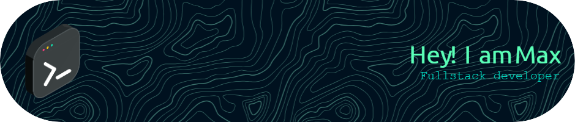

# **Hi 👋, I am Max**

 My name is **Maxim R.** I'm a Full-Stack Developer and student at **[ITPG-Varna](https://itpg-varna.bg)**, currently studying to become an AI developer.

 

###

  

###

- 🔭 I’m currently working on **Azion Online**

- 🌱 I’m currently learning **CMake** and **C++**

- 👨‍💻 All of my projects are available at [https://github.com/Maximus019BG/](https://github.com/Maximus019BG?tab=repositories&type=source)

<!-- [//]: <> (- 🤝 I’m looking to begin with my project: **School NET**) -->

- ⚡ Fun fact about me **Full-stack developer with experience in building web applications using: Front-end: HTML, CSS (Tailwind), JavaScript (TypeScript, React, Nextjs) Back-end: Python (Django, Flask), PHP, Java (SpringBoot) Databases: SQL (MySQL), NoSQL (MongoDB) and ***I LOVE BASKETBALL***🏀**

## Connect with me  

  

<h2 >Frontend</h3>

  
  
  
   
  
  

<h2 >Backend</h3>

  
  
  
  
  
  
  
  
  

<h2 >Database</h3>

  
  

<h2 >Version Control</h3>

  

  
 

  

   
  

